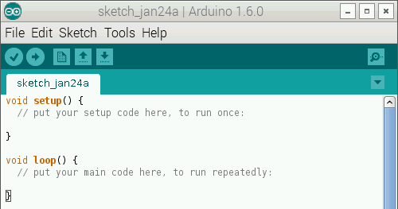

Arduino IDE for ARM
===================



This repository contains patches and precompiled binaries of the Arduino IDE for ARM.
The binaries were compiled on a raspberry pi or an x64 linux machine via cross compilation.

Compatible Devices
==================

Tested devices are:

* Raspberry Pi2
* [Open a ticket if your device works](https://github.com/NicoHood/Arduino/issues)

Download + Installation
=======================

Please refere to the [releases page](https://github.com/NicoHood/Arduino/releases)
to get the latest working IDE. I will try to tag each version that compiles fine for me.
**The current git state might not work, please refere to the tags of the releases!**

To install the software just extract the package with `tar -xf arduino-1.x.x.tar.xz`.
You can also run the `install.sh` script to install the IDE on your ARM device.

Special Thanks
==============

The Arduino IDE for ARM would not be possible with a lot of work from other people.
In this section I want to give credit for them and provide some additional resources.
Thanks a lot for all the help and work you've done!

* https://github.com/arduino/Arduino/pull/4457
* https://github.com/arduino/Arduino/pull/3549
* https://github.com/ShorTie8/Arduino_IDE
* https://www.raspberrypi.org/forums/viewtopic.php?f=66&t=92662

[Contact me.](http://www.NicoHood.de)

Changelog
=========

```
1.6.8-rc1 Release (29.01.2015)
* Release of the first working Arduino IDE compilation
* Last upstream commit was: fa0d5808462a435c7178121585f90668223e017d
* libserials is actually version 1.0.7 not 1.0.5
```

Arduino
========

* Arduino is an open-source physical computing platform based on a simple I/O
board and a development environment that implements the Processing/Wiring
language. Arduino can be used to develop stand-alone interactive objects or
can be connected to software on your computer (e.g. Flash, Processing and MaxMSP).
The boards can be assembled by hand or purchased preassembled; the open-source
IDE can be downloaded for free at http://www.arduino.cc/en/Main/Software

* For more information, see the website at: http://www.arduino.cc/
or the forums at: http://www.arduino.cc/forum/  
You can also follow Arduino on Twitter at: https://twitter.com/arduino or
like Arduino on Facebook at: https://www.facebook.com/official.arduino

* To report a *bug* in the software or to request *a simple enhancement* go to:
http://github.com/arduino/Arduino/issues

* More complex requests and technical discussion should go on the Arduino Developers
mailing list:
https://groups.google.com/a/arduino.cc/forum/#!forum/developers

* If you're interested in modifying or extending the Arduino software, we strongly 
suggest discussing your ideas on the Developers mailing list *before* starting
to work on them. That way you can coordinate with the Arduino Team and others,
giving your work a higher chance of being integrated into the official release
https://groups.google.com/a/arduino.cc/forum/#!forum/developers

Installation
------------
Detailed instructions are in reference/Guide_Windows.html and
reference/Guide_MacOSX.html.  For Linux, see the Arduino playground:
http://www.arduino.cc/playground/Learning/Linux

Credits
--------
Arduino is an open source project, supported by many.

The Arduino team is composed of Massimo Banzi, David Cuartielles, Tom Igoe
and David A. Mellis.

Arduino uses
[GNU avr-gcc toolchain](http://gcc.gnu.org/wiki/avr-gcc),
[GCC ARM Embedded toolchain](https://launchpad.net/gcc-arm-embedded),
[avr-libc](http://www.nongnu.org/avr-libc/),
[avrdude](http://www.nongnu.org/avrdude/),
[bossac](http://www.shumatech.com/web/products/bossa),
[openOCD](http://openocd.org/)
and code from [Processing](http://www.processing.org)
and [Wiring](http://wiring.org.co).

Icon and about image designed by [ToDo](http://www.todo.to.it/)

